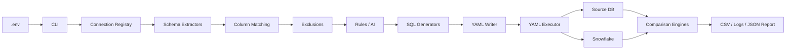

# Version 3.1 Architecture

## High-Level Flow



## Connection Layer

`src/db/factory.py` loads credentials using `python-dotenv` and creates the correct adapter.

Adapters implement a common interface:

```python
connect()
execute_query(query)
```

The factory infers the profile when YAML omits `source_name`:

- PostgreSQL → `SRC_1`
- MSSQL → `SRC_2`
- Athena → `SRC_3`
- Snowflake → `SNOWFLAKE`

The MSSQL adapter uses the working connection settings:

```text
TrustServerCertificate=yes
Encrypt=optional
Connection Timeout=30
```

## Generation Layer

`src/validation_pipeline.py` coordinates:

1. Source schema extraction
2. Target schema extraction
3. Column exclusion
4. Column matching
5. Rule assignment
6. Standard SQL generation
7. Dynamic suite generation
8. YAML serialization

`QueryOutputManager` generates standard validation queries.

`DynamicSuiteGenerator` profiles the source table, selects checks, and calls `QueryOptimizer`.

## AI Layer

AI can assist with ambiguous mappings and SQL generation.

The AI prompt receives:

- Source and target database types
- Source and target column types
- Transformation rule
- Castability requirements
- NULL and timezone behavior
- Required aliases and filters

AI responses are checked before acceptance. Invalid output falls back to deterministic rules.

## Exclusion Layer

Exclusions come from:

- `config/exclusions.yaml`
- Static ETL/Fivetran exclusions
- Interactive user selections
- `--exclude` command-line values

The source column list is filtered before matching, so excluded columns do not reach SQL generation.

## Validation Layer

### Count validator

Executes source and target count queries and compares scalar row counts.

### Data validator

Executes normalized queries, resolves primary-key columns case-insensitively, supports normalized aliases, detects missing rows, and writes mismatch CSV files.

### Dynamic checks

The dynamic suite supports:

- NULL percentage
- Distinct count
- MIN/MAX
- SUM
- Duplicate business keys
- VALUE_DIST grouped result sets

## Output Layer

Reports are stored under repository `output/`, independent of the current working directory. Running from `src/` does not create a separate `src/output/` tree.
